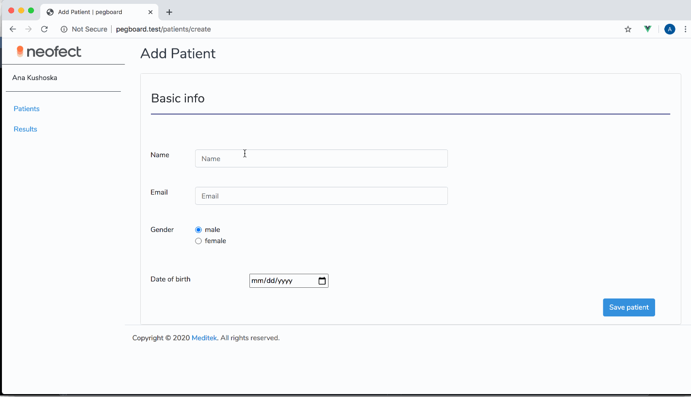

Pegboard is a small software package designed to affiliate the healthcare professionals effort while using a neuro-rehabillitation unit Smart-Pegboard. With this software patient related data can be stored, processed and reported. It can be usefull for tracking the patient result and following it's improvement over the time. 

